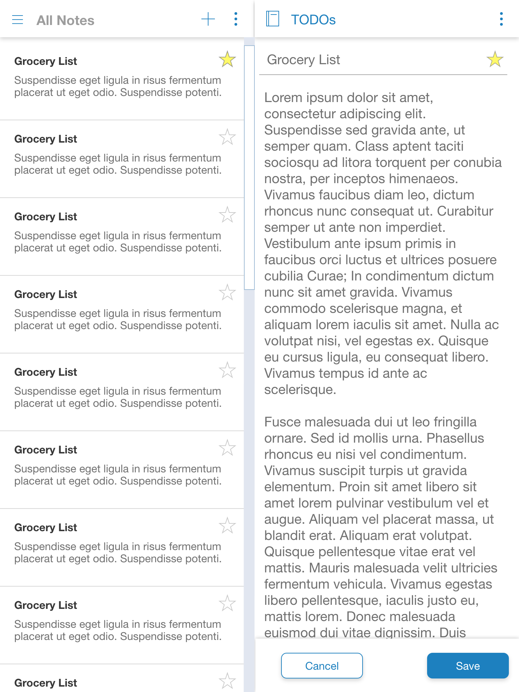

# Richnote [](https://github.com/standard/standard)

 Richnote is a note-taking app with rich editor built with React/Redux.

## Setup

Dependency: Yarn (1.17.0+) needs to be installed before running the following commands.

```bash
# Install packages
yarn install

# Start the server
yarn start
```

## Design Prototype

Richnote is designed with Adobe XD.

### Videos

Watch a prototype preview video on YouTube at <https://youtu.be/vL9yHQR1ddU>.

### Screenshots

Design for tablet size screen



[More Details](doc/ux_design/ux_design.md)

## Development

- [Coding Notes](doc/coding_notes.md)
