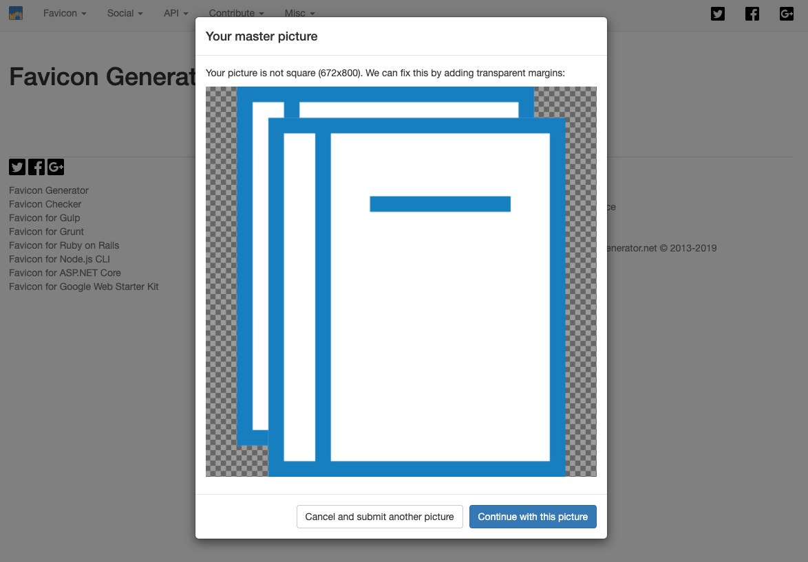
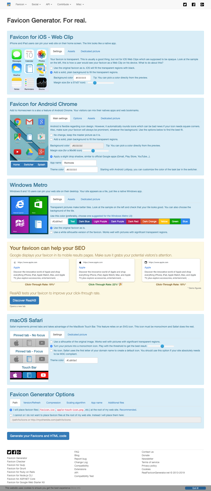
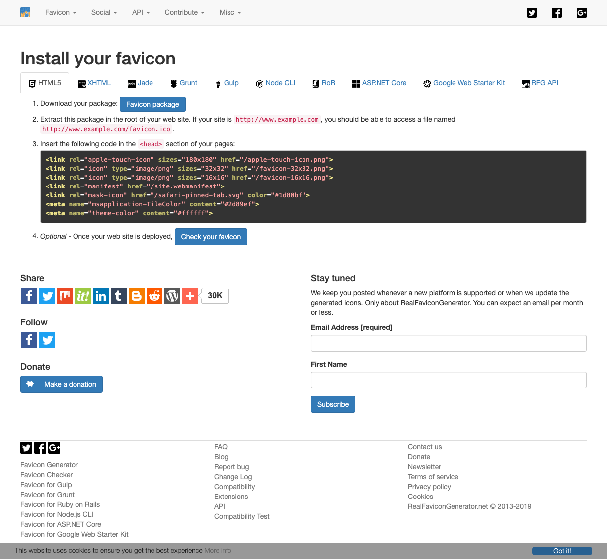

# Favicon Generation

https://realfavicongenerator.net/

1. Create an icon in SVG 
2. Upload it
3. Add Transparent Margins 
4. Configuration — optimize for every environments 
5. Installation 

```html
<link rel="apple-touch-icon" sizes="180x180" href="/apple-touch-icon.png">
<link rel="icon" type="image/png" sizes="32x32" href="/favicon-32x32.png">
<link rel="icon" type="image/png" sizes="16x16" href="/favicon-16x16.png">
<link rel="manifest" href="/site.webmanifest">
<link rel="mask-icon" href="/safari-pinned-tab.svg" color="#1d80bf">
<meta name="msapplication-TileColor" content="#2d89ef">
<meta name="theme-color" content="#ffffff">
```
